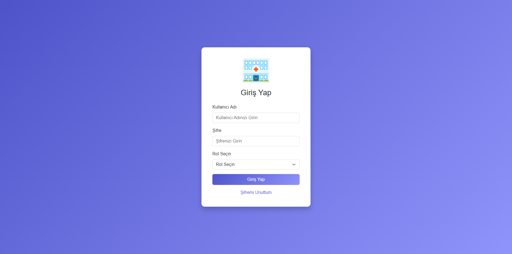
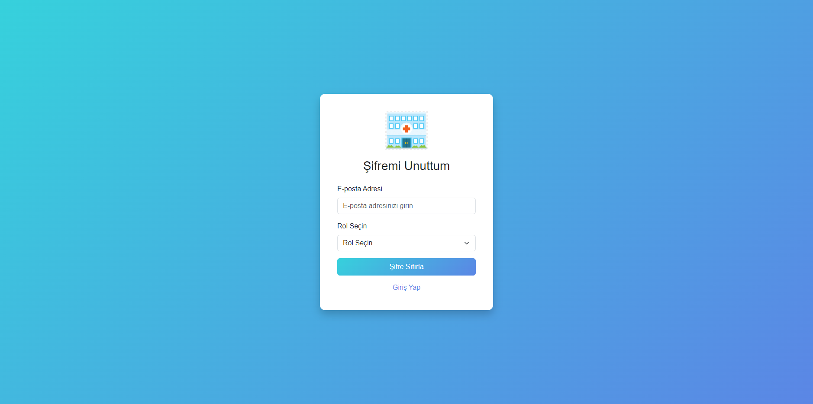
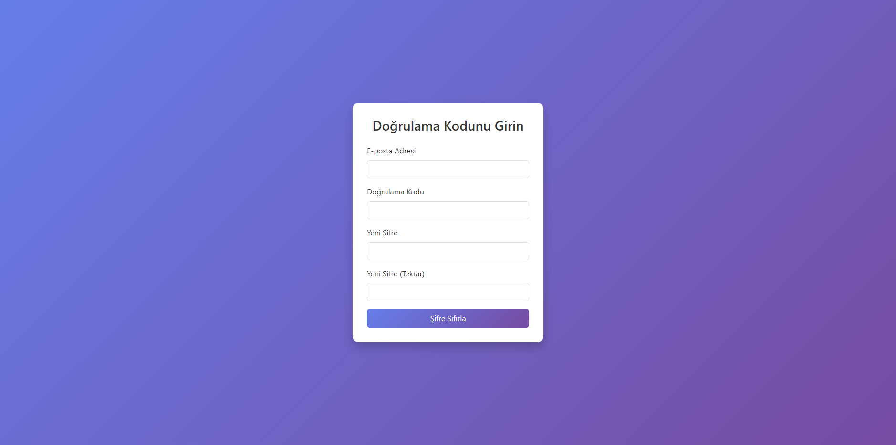
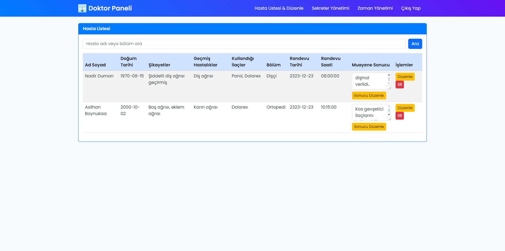
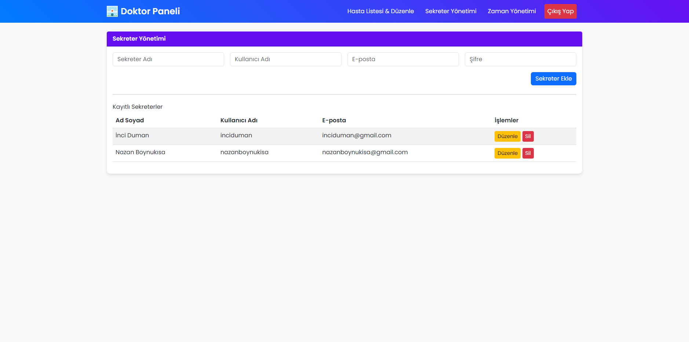
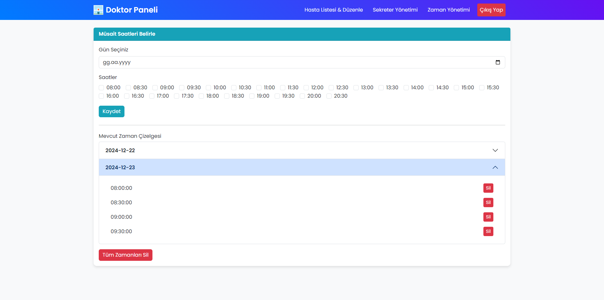
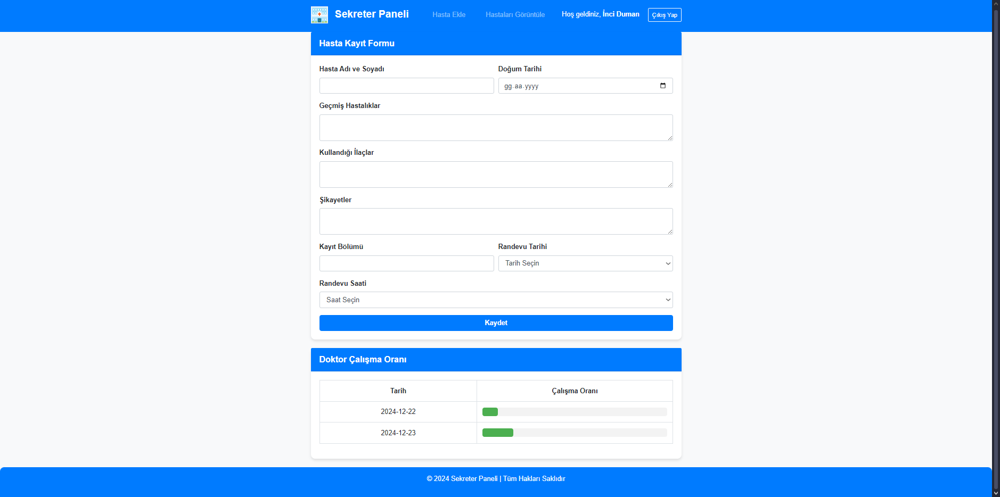
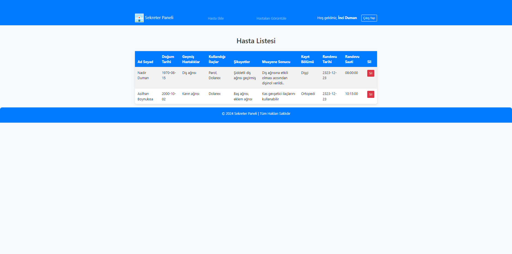

# Hospital Appointment and Management System project
 Html, Css, Bootstrap, JavaScript and PHP 
# Hospital Appointment and Management System

This project is a specialized appointment and patient management system developed for **Doctor** and **Secretary** roles in clinical/hospital environments.

## Features

1. **User Roles and Authentication**
   - Two distinct roles are defined: Doctor and Secretary.
   - PHP-based authentication system for login and logout.
   - Password reset flow with verification code support and new password setup.

2. **Doctor Panel**
   - Doctors can view, edit, or delete their patient lists.
   - Manage working hours (available days and time slots).
   - Perform actions like adding/removing secretaries and editing secretary details.

3. **Secretary Panel**
   - Secretaries can create new patient records.
   - Edit or delete appointment dates and times of patients.
   - Plan appointments for patients by selecting only the availability defined by the doctor.

4. **Database Structure**
   - **users**: Stores details of users in Doctor and Secretary roles.
   - **patients**: Contains data about patients such as name, surname, date of birth, and appointment date/time.
   - **doctor_availability**: Keeps records of the doctor's working hours.

5. **Interface and Design**
   - Modern and responsive UI built with **Bootstrap**.
   - Includes gradient backgrounds, shaded cards, and user-friendly forms.
   - Displays error and success messages to enhance user experience.

6. **How to Install and Run?**
   1. **Database**:
      - Create a database named `appointment_system`.
      - Import the SQL file provided in the project (e.g., `appointment_system.sql`).
   2. **Connection Settings**:
      - Edit database connection details like server, username, and password in `db.php` or `db_connection.php`.
   3. **Login**:
      - Access the system as a doctor or secretary through **login.html** (or `index.php`).
   4. **Roles**:
      - Doctor panel: `doctor_panel.php`.
      - Secretary panel: `secretary.php`.

7. **Technologies Used**
   - **PHP 7+** (Backend)
   - **MySQL** (Database)
   - **Bootstrap 4/5** (Design & UI)
   - HTML5, CSS3, JavaScript

## Contribute
1. Fork this repository and create a feature branch.
2. Make your changes or add new features.
3. Submit a pull request after your changes are complete.
4. Your code will be reviewed and merged upon approval.

## License
This project is licensed under the MIT License. See the [LICENSE](./LICENSE) file for details.

## Screenshots

### Login Form

### Reset Form 

### Reset Password Form 

### Doctor Panel

### Doctor Secretary Management

### Doctor Time Management

### Secretary Panel

### Secretary Panel

